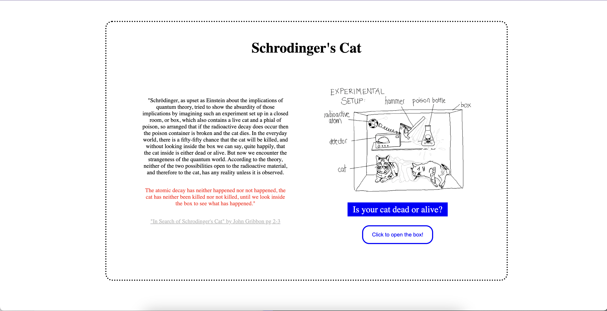
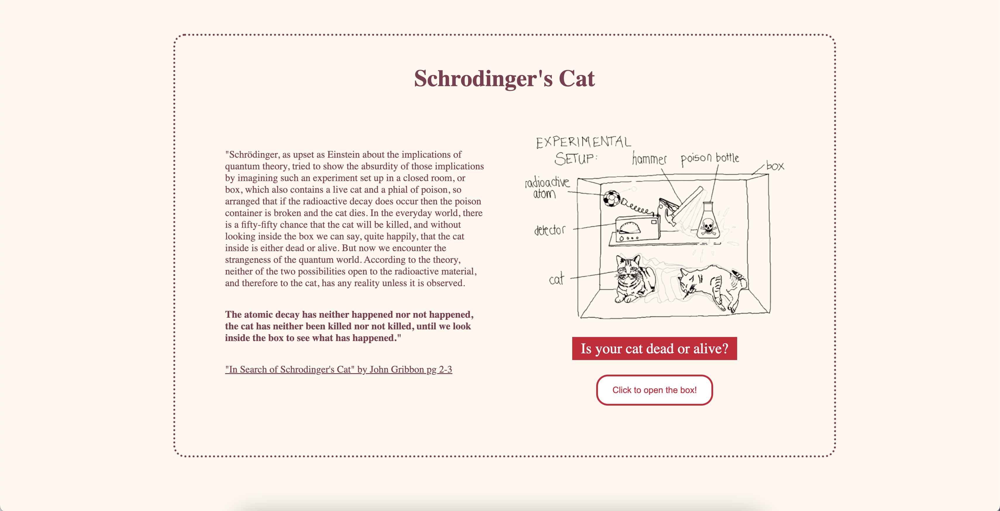
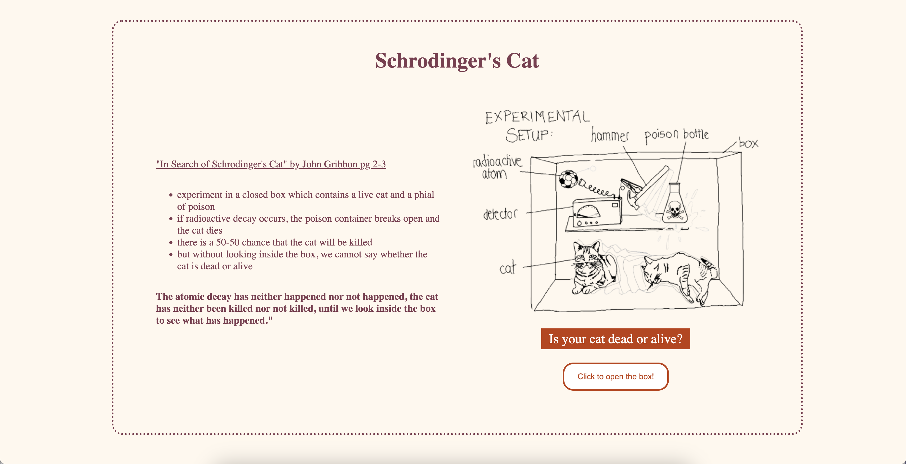

# Version 1

The first iteration completed in class.  

# Version 2

## Changes Made:

Note: All changes have comments above them. I mostly focused on text & readability here.

1. Added alt text to the images in index.html & script.js.
2. Increased the font size to 17px, allowing people with dyslexia or having trouble reading small text to read more easily.
3. Changed the background color to a cream off white color to reduce the glaring brightness of pure white that can cause discomfort for the eye.
(removed the background for the main image to match the page background)
4. Removed color red and changed to bold black, as some people may have trouble reading red text.
5. Made the grey darker as light grey may be too hard to read.
6. Changed text-align from center to left, to make it easier to read.
7. Changed the color of the text and the buttons according to randoma11y.com, a website that generates contrast colors that generally meets most of the accesibility guidelines.  

# Version 3

## Changes Made:

Note: All changes have comments above them. I mostly focused on the overall design consideration for readability here.

1. Changed the order of the text, and turned the paragraph into bullet points, making it easier to read, according to the youtube video, "9 Web Design Hacks I Wish I Knew Years Ago" by Self-Made Web Designer.
2. Reduced the padding to make the text more spread out and in a rectangular shape, reducing the excess text spilling out.
3. Increased font size from 17px to 19px, as reducing word count led to more available space.
4. Made the entire dotted box larger, reducing the need for unnecessary white space outside the box.
5. Changed the color of the buttons and highlighted color of the text because the previous red was too bright in consideration with the off white background and red-brown text color. 